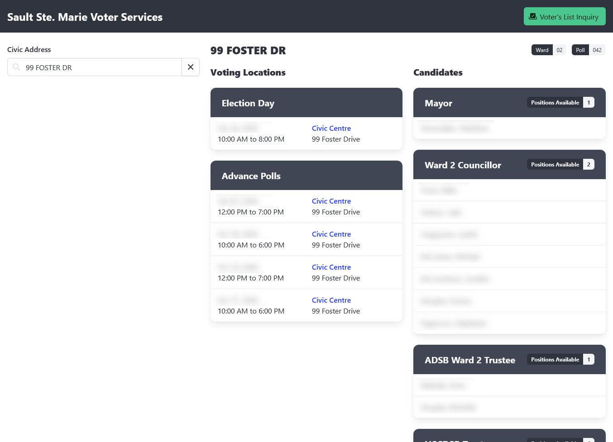

# Voter Services Online

[](https://app.deepsource.com/gh/cityssm/voter-services-online/)

An online portal to assist voters with navigating municipal elections,
using the VoterView API.

🚧 **Under Development**



## Features

- ℹ️ Find voting locations and candidates by address.
- 🔎 Check whether or not you're on the voters list.
- ➕ Add yourself to the voters list.
- ✏️ Update your voters list record.
- ✉️ Sign up for "Vote by Mail".

## Getting Started

This application requires a current version of
[Node](https://nodejs.org/) to run,
along with active VoterView API access.

After downloading a release or cloning a copy of this repository,
install the application dependencies.

```sh
npm install --omit=dev
```

Next, in the `data` folder, create a `config.js` file.
Use the `sample.config.js` file for guidance.

```javascript
// sample.config.js

export const config = {
  application: {
    httpPort: 8080,
    applicationName: 'Sample City Voter Services',
    footer: '_mainFooterOntario2026'
  },

  reverseProxy: {},

  voterViewApi: {
    countyMunicipalityCode: '9999',
    username: 'SAMPLE',
    password: 'samplePass',
    useTrainingDatabase: true
  },

  settings: {
    city: 'Sample City',
    province: 'ON'
  }
}

export default config
```

Finally, start the application.

```sh
npm start
```

Alternatively, the application can be installed as a Windows service.

```sh
windowsService-install.bat
```

## About this Project

Although the system is quite niche, it's being released in an open source
environment in hopes to pool developer resources from other municipalities
looking to move away from older, legacy systems.

It is being shared to start the dialog among other municipalities and present
an option to those using VoterView who may be looking to implement a portal
for their voters.

## Related Projects

[**@cityssm/voterview-api**](https://github.com/cityssm/node-voterview-api)<br />
An unofficial wrapper around the VoterView Online Voter Services REST API.
